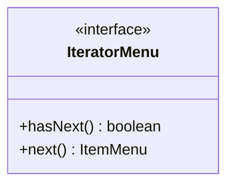

# 🍔 Sabor na Brasa - Projeto de Padrões de Projeto em Java

## 📌 Descrição

O projeto **Sabor na Brasa** é um sistema de hamburgueria desenvolvido em **Java** com o objetivo de demonstrar a aplicação prática dos principais **Design Patterns (Padrões de Projeto)** da programação orientada a objetos.

Cada padrão foi implementado em um contexto relacionado ao funcionamento de uma hamburgueria, facilitando o entendimento do conceito de forma prática e organizada.

---

## 🚀 Tecnologias Utilizadas

- Java
- Programação Orientada a Objetos (POO)
- UML / Mermaid
- IntelliJ IDEA / Eclipse

---

## 📂 Estrutura do Projeto

O projeto está organizado em pacotes, onde cada pacote representa um padrão de projeto:

```text
com.sabornabrasa
│── abstractfactory
│── bridge
│── builder
│── chain
│── composite
│── decorator
│── facade
│── factorymethod
│── flyweight
│── iterator
│── mediator
│── memento
│── observer
│── prototype
│── singleton
│── state
│── strategy
│── templatemethod
│── visitor
│── Main.java
```

---

## 🧩 Padrões de Projeto Implementados

### Criacionais
- **Singleton** → Configuração única do sistema
- **Builder** → Construção de hambúrgueres
- **Factory Method** → Criação de lanches
- **Abstract Factory** → Criação de famílias de produtos
- **Prototype** → Clonagem de hambúrgueres

### Estruturais
- **Bridge** → Separação entre hambúrguer e ingredientes
- **Composite** → Criação de combos
- **Decorator** → Adição de ingredientes extras
- **Facade** → Interface simplificada para pedidos
- **Flyweight** → Compartilhamento de ingredientes

### Comportamentais
- **Chain of Responsibility** → Fluxo de atendimento
- **Iterator** → Percorrer itens do menu
- **Mediator** → Comunicação entre cliente e cozinha
- **Memento** → Histórico de pedidos
- **Observer** → Notificação de clientes
- **State** → Estados do pedido
- **Strategy** → Estratégias de desconto
- **Template Method** → Preparação de pedidos
- **Visitor** → Operações sobre itens do pedido

---

## ▶️ Como Executar

### 1. Clone o repositório

```bash
git clone https://github.com/seu-usuario/sabor-na-brasa.git
```

### 2. Abra no IntelliJ ou Eclipse

Importe o projeto Java normalmente.

### 3. Execute a classe principal

```text
Main.java
```

---

## 📌 Exemplo de Saída

```text
=== SINGLETON ===
Hamburgueria: Sabor na Brasa

=== BUILDER ===
Hambúrguer Tradicional criado...

=== PROTOTYPE ===
Original: X-Burger - R$ 30.0
Clone: X-Burger - R$ 30.0

=== ITERATOR ===
X-Burger
X-Salada
X-Bacon
```

---

## 📊 Diagramas UML

O projeto possui diagramas de classe desenvolvidos em **Mermaid** para os padrões:

- Flyweight
- Iterator
- Prototype

Exemplo:



---

## 🎯 Objetivo Acadêmico

Este projeto foi desenvolvido com fins acadêmicos para demonstrar:

- Aplicação prática de Design Patterns
- Organização em pacotes
- Reutilização de código
- Boas práticas de POO
- Modelagem UML

---

## 👨‍💻 Autor

Desenvolvido por **[Seu Nome]**

Projeto acadêmico de **Padrões de Projeto em Java**